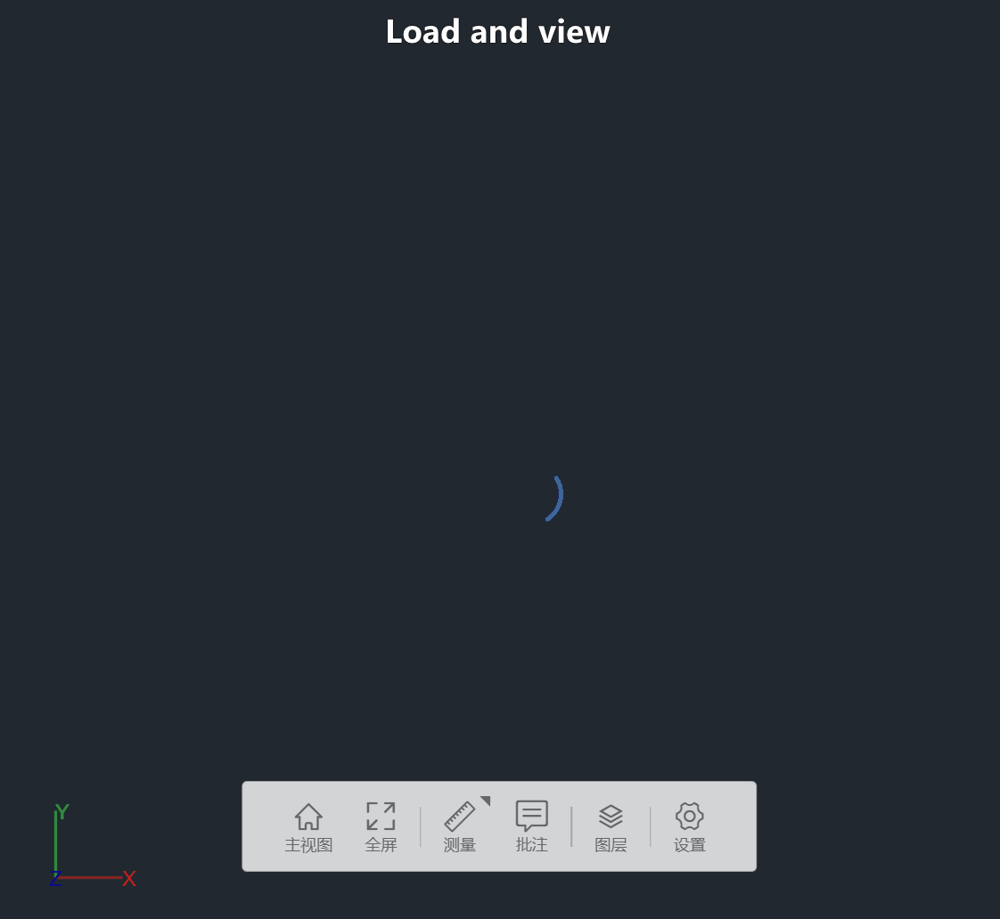
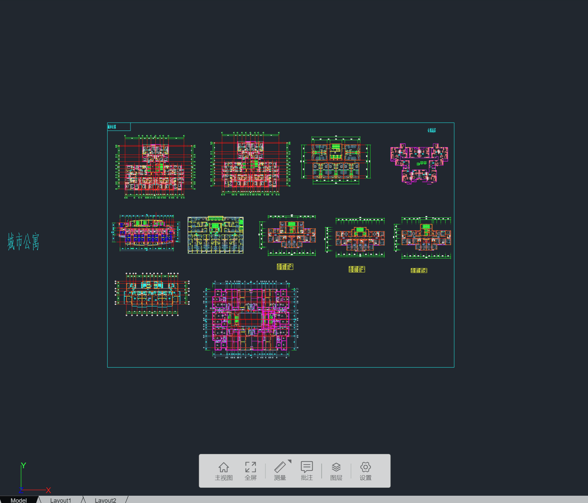
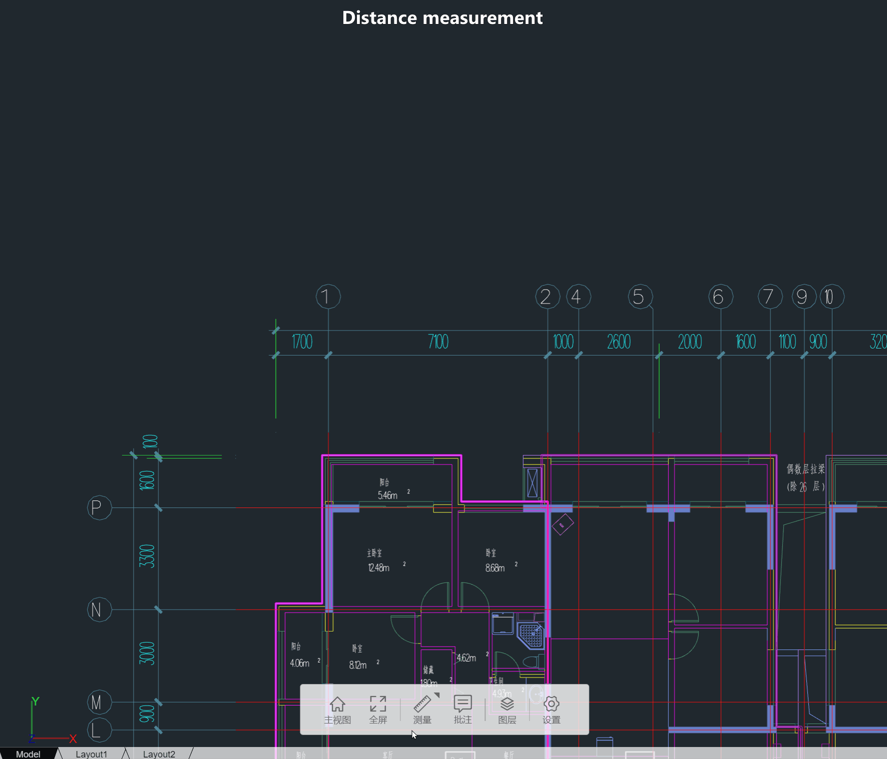
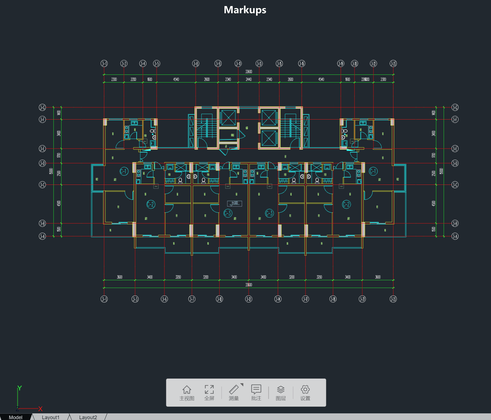
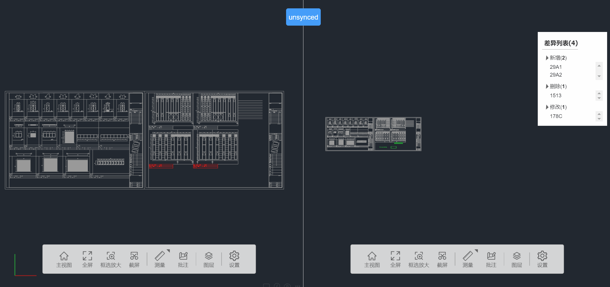
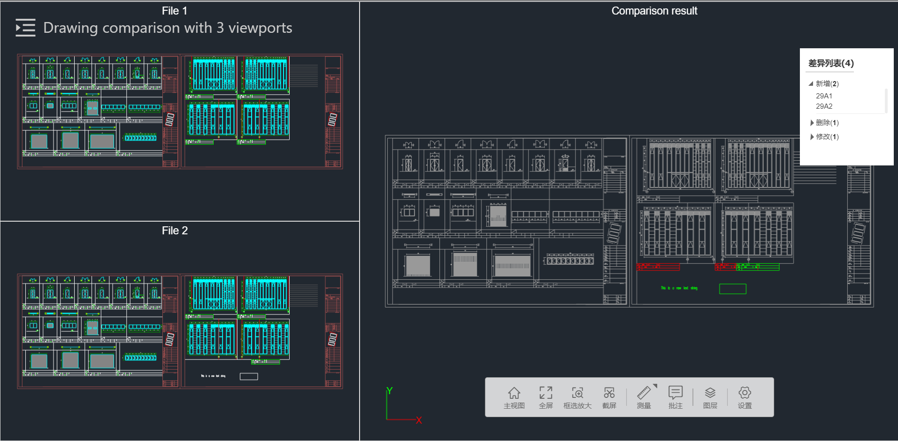

# dxf-viewer-examples
Examples for viewing DXF files using Three.js and Vue3.

## Project setup
```
npm install
```

### Compiles and hot-reloads for development
```
npm run serve
```

### Compiles and minifies for production
```
npm run build
```

### Lints and fixes files
```
npm run lint
```


# x-viewer
This example project is built on a WebGL based JS SDK, which provides a Viewer2d.

### Viewer2d
The Viewer2d class is utilized for viewing 2D drawings and PDF. To work with DWG files, they need to be converted to DXF format first using the dwg2dxf.exe worker. The tool supports most common entity types, OLE, and regions via dwg2dxf conversion. It also supports common line types, hatch styles, and line widths.

### Example
``` typescript
import { Viewer2d, Viewer2dConfig, ModelConfig } from "x-viewer";

const viewerCfg: Viewer2dConfig = {
    containerId: "myCanvas",
    enableSpinner: true,
    enableLayoutBar: true,
};
const modelCfg: ModelConfig = {
    modelId: "id_0",
    name: "sample",
    src: "http://www.abc.com/sample.dxf",
}
const fontFiles = ["http://www.abc.com/hztxt.shx", "http://www.abc.com/simplex.shx"];

const viewer = new Viewer2d(viewerCfg);
await viewer.setFont(fontFiles);
await viewer.loadModel(modelCfg, (event) => {
    const progress = (event.loaded * 100) / event.total;
    console.log(`${event.type}: ${progress}%`);
});
console.log("Loaded");
viewer.goToHomeView();
```

### Features
- Viewer2d features includes: load and view one or more dxf files, basic mouse/key operations, layouts, layers, distance/area/angle measurements with osnaps, markups, hotpoints, comparison, undo/redo for measurements/markups, zoom to selected area, screenshots, set background color, etc.
- Supported entity types includes: POINT, 3DFACE, ARC, ATTDEF, ATTRIB, CIRCLE, DIMENSION, MLEADER, MULTILEADER, ELLIPSE, HATCH, INSERT, LEADER, LINE, LWPOLYLINE, MTEXT, RAY, POLYLINE, SOLID, SPLINE, TEXT, VERTEX, VIEWPORT, XLINE, etc. IMAGE, OLE2FRAME, REGION are partially supported.

- Load and view dxf file

- Switch between layouts

- Distance measurement

- Area measurement
- Angle measurement
- Markups

- Comparison


- Undo/redo

### Limitations
- It doesn't support complex linetypes, e.g., linetype with text in it.
- It uses line geometries to represent texts rather than mesh, for a better performance.
- It doesn't support polyline with different start and end width.
- It doesn't support Tangent CAD, need to export to T3 format first.
- It supports dxf version "AutoCAD 2018", other versions are not well tested.

